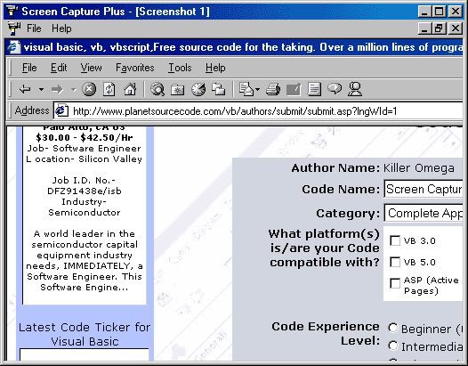



## Screen Capture Plus

### Description

This is a program made by §pyder and I. Basicly it allows you to take a screenshot and do a number of things with it. Please check it out and leave feedback!
 
### More Info
 

             |
---                |---
**Submitted On**   |2000-12-02 14:45:54
**By**             |[Killer Omega](https://github.com/Planet-Source-Code/PSCIndex/blob/master/ByAuthor/killer-omega.md)
**Level**          |Intermediate
**User Rating**    |3.6 (18 globes from 5 users)
**Compatibility**  |VB 6\.0
**Category**       |[Complete Applications](https://github.com/Planet-Source-Code/PSCIndex/blob/master/ByCategory/complete-applications__1-27.md)
**World**          |[Visual Basic](https://github.com/Planet-Source-Code/PSCIndex/blob/master/ByWorld/visual-basic.md)
**Archive File**   |[CODE\_UPLOAD122801232000\.zip](https://github.com/Planet-Source-Code/killer-omega-screen-capture-plus__1-13279/archive/master.zip)

